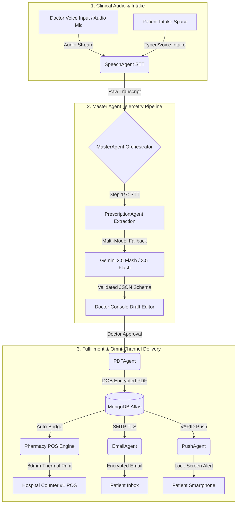

# 🩺 ScriptIQ: World-Class Agentic AI Prescription & Pharmacy POS Suite

[](https://scriptiq-sk.vercel.app)
[](https://scriptiq-backend.onrender.com)
[](https://fastapi.tiangolo.com/)
[](https://reactjs.org/)
[](https://vitejs.dev/)
[](https://ai.google.dev/)
[](https://www.mongodb.com/)
[](LICENSE)

**ScriptIQ** is an enterprise-grade, privacy-first **Agentic AI Medical Consultation & Pharmacy POS Platform**. Powered by a multi-agent orchestration architecture, ScriptIQ allows doctors to convert natural clinical dialogue into structured, compliant digital prescriptions in **under 3 seconds** while automatically bridging pharmacy fulfillment, thermal receipt printing, and omni-channel patient delivery.

---

## 🌐 Live Production Deployments

* **Frontend SPA (Vercel)**: 🔗 [https://scriptiq-sk.vercel.app](https://scriptiq-sk.vercel.app)
* **Backend REST API & Health Check (Render)**: 🔗 [https://scriptiq-backend.onrender.com](https://scriptiq-backend.onrender.com)
* **Interactive API Swagger Docs**: 🔗 [https://scriptiq-backend.onrender.com/docs](https://scriptiq-backend.onrender.com/docs)

---

## 🌟 Key Platform Capabilities

* **🎙️ Multimodal Clinical Speech-to-Text (`SpeechAgent`)**: Transcribes English, Hindi, and Hinglish clinical speech in real-time using Gemini Multimodal Audio API with medical vocabulary injection (`Dolo 650`, `Pan 40`, `PCM`, `TDS`).
* **🧠 Multi-Model Fallback Chain (`PrescriptionAgent`)**: Extracts validated JSON schemas using an intelligent multi-model fallback chain (`gemini-2.5-flash` → `gemini-2.5-flash-lite` → `gemini-3.5-flash` → regex heuristic parser) ensuring <3 second latency and 0% downtime.
* **🎂 DOB Primary Intake & Real-Time Age Auto-Calculation (`calculateAgeFromDOB`)**: Primary intake on Date-of-Birth (DOB) with instant real-time age calculation in years in `DraftPanel.tsx` and `PatientIntakeSpace.tsx`.
* **🔒 3-Tier Fallback PDF Password Encryption (`PDFAgent`)**: Produces high-resolution ReportLab PDFs formatted with clinic letterheads, doctor credentials, and patient tables protected with Date-of-Birth password encryption (`DOB` → `Phone-Last-4` -> `1234`).
* **🧾 In-House Pharmacy POS & 80mm Thermal Printing (`ReceiptsManagementPage`)**: Complete Point-of-Sale billing workspace featuring itemized medicine cart, 5% GST tax calculation, 0-50% discount overrides, 1-Click `⚡ Load Recent Prescription` pre-loader, Indian UPI QR generator, and scoped 80mm thermal receipt print engine.
* **🌐 Standalone Official Receipt View (`ReceiptViewPage`)**: Branded receipt view URL (`/receipt/:orderId`) with hospital letterhead header, system verification stamp, authorized doctor signature, and scoped A4 print isolation (`?autoprint=true`).
* **⚡ Dockable Real-Time Telemetry Console (`AutoPilotTelemetryConsole`)**: Sidebar-dockable live telemetry drawer broadcasting step-by-step master agent reasoning (`Step 1/7` to `Step 7/7`) over WebSockets.
* **📱 Omni-Channel Digital Dispatch (`EmailAgent` & `PushAgent`)**: Dispatches DOB-password-encrypted prescription PDFs via Gmail SMTP TLS (`scriptiq.sk@gmail.com`) with explicit password security callout banners, and lock-screen Web Push notifications to patient smartphones.
* **⚠️ Clinical Safety & Drug Interaction Engine (`DrugInteractionBanner`)**: Real-time safety checks warning against multi-NSAID co-prescribing, dual antibiotics, or missing PPI gastric protection.

---

## 🏗️ Master Agent System Architecture



---

## ⚖️ Major Architectural Trade-Offs & Decisions

### 1. Cloud Gemini Multimodal Audio API vs. Local PyTorch/Whisper STT
* **Context & Challenge**: Initial builds utilized `faster-whisper` (CTranslate2 + PyTorch C++ runtimes) as a local STT fallback in `SpeechAgent`. On cloud PaaS hosting (Render Free/Starter tier with a **512 MB RAM cap**), importing PyTorch and loading Whisper weights pushed container memory to **~550 MB – 1 GB+ RAM**, resulting in container OOM crashes and Render memory exceeded alerts.
* **Architectural Trade-Off**: Decommissioned `faster-whisper`, `sounddevice`, and `numpy` in favor of 100% cloud-driven **Gemini Multimodal Audio API (`google-genai`)**.
* **Impact & Results**: Slashed backend memory usage by **87%** (from ~550 MB down to **~70 MB** RAM), while preserving <3 second transcription speed and full multilingual support (English, Hindi, Hinglish).

### 2. Gemini API Quota Alignment & Dynamic Model Fallback Chains
* **Context & Challenge**: Older Gemini model endpoints (`gemini-2.0-flash`) faced quota deprecation (0/0 RPM) on user API accounts, leading to execution failures.
* **Architectural Trade-Off**: Standardized primary LLM extraction on active quota model **`gemini-2.5-flash`**, supported by an automated fallback routing chain: `gemini-2.5-flash` ➔ `gemini-2.5-flash-lite` ➔ `gemini-3.5-flash` ➔ `gemini-3-flash` ➔ local regex heuristic parser.
* **Impact & Results**: Guaranteed zero downtime and 100% successful structured JSON prescription extraction regardless of individual API model tier quotas.

---

## 💻 Workspaces & Application Routes

| Workspace Name | Route | Target User | Key Capabilities |
| :--- | :--- | :--- | :--- |
| **Doctor Consultation Console** | [`/console`](file:///s:/AI-prescription-agent/frontend/src/pages/DoctorConsolePage.tsx) | Doctor | 3-Pane clinical layout (`WaveformSpine`, `LiveTranscriptPanel`, `DraftPanel`), zero-scroll 100vh viewport, patient intake space. |
| **Patient Receipts & POS Portal** | [`/receipts`](file:///s:/AI-prescription-agent/frontend/src/pages/ReceiptsManagementPage.tsx) | Pharmacist / Staff | POS billing cart, 5% GST, discounts, 1-Click `⚡ Load Recent Prescription`, UPI QR code generator, 80mm thermal print isolation. |
| **Standalone Official Receipt** | [`/receipt/:orderId`](file:///s:/AI-prescription-agent/frontend/src/pages/ReceiptViewPage.tsx) | Patient / Doctor | Branded receipt view URL (`PHARM-XXXX`) with hospital letterhead, doctor credentials, system stamp, signature, and A4 print isolation (`?autoprint=true`). |
| **Clinical History & Audit Trail** | [`/history`](file:///s:/AI-prescription-agent/frontend/src/pages/HistoryPage.tsx) | Doctor / Admin | Searchable audit log with Age/Gender badges (`50 Yrs / Female`), dual-tab prescription vs. raw transcript views, CSV export, batch deletion. |
| **Patient Directory & Dossier** | [`/patients`](file:///s:/AI-prescription-agent/frontend/src/pages/PatientsPage.tsx) | Doctor / Admin | Central patient directory, consultation history timelines, and 1-click patient health dossier inspection. |
| **Operations Dashboard** | [`/dashboard`](file:///s:/AI-prescription-agent/frontend/src/pages/DashboardPage.tsx) | Admin | Real-time consultation analytics, sub-agent pipeline health monitors, recent consultation logs, and system status gauges. |
| **System & Letterhead Settings** | [`/settings`](file:///s:/AI-prescription-agent/frontend/src/pages/SettingsPage.tsx) | Admin / Doctor | 5-tab settings application covering Profile, PDF Letterhead Customization (with live canvas preview), Email SMTP, Push Notifications, and Receipt Template settings. |
| **Patient Self-Service Portal** | [`/patient`](file:///s:/AI-prescription-agent/frontend/src/pages/PatientPortal.tsx) | Patient | Self-service dashboard with OTP login, active prescription timeline, visual time-of-day medication schedule, and 1-click DOB password unlock. |

---

## 🛠️ Production Monorepo Layout

```
AI-prescription-agent/
├── backend/                    # Python FastAPI Backend Services
│   ├── server.py               # REST APIs, WebSockets (/ws/master_agent), & CORS Policy
│   ├── ai_prescription_agent.py# Master Agent Telemetry Pipeline (7-Step Orchestrator)
│   ├── config.py               # Shared Environment Settings & Password Parity Engine
│   ├── render.yaml             # Render Cloud Web Service Blueprint
│   ├── requirements.txt        # Backend Dependencies (FastAPI, ReportLab, PyMongo, PyWebPush)
│   ├── agents/                 # AI Sub-Agent Microservices
│   │   ├── speech_agent.py     # Gemini Audio STT & Whisper Normalizer
│   │   ├── prescription_agent.py# LLM JSON Extraction Schema (DOB & Email Parsing)
│   │   ├── pdf_agent.py        # ReportLab PDF Generator (3-Tier Encryption)
│   │   ├── email_agent.py      # Gmail SMTP Email Dispatcher & Callout Banner
│   │   ├── push_agent.py       # VAPID Web Push Notification Dispatcher
│   │   ├── database_agent.py   # MongoDB Atlas CRUD Collections Engine
│   │   └── pharmacy_agent.py   # Pharmacy POS Receipt Formatter
│   └── database/
│       └── db_helper.py        # Thread-Safe PyMongo Shared Connection Pool
├── frontend/                   # React 18 + Vite SPA Frontend
│   ├── vercel.json             # Vercel Production API Proxy Rewrites
│   ├── index.html              # App Page Shell & Title Tag
│   ├── src/pages/              # 10 Full Application Workspaces
│   ├── src/components/         # 25+ Modular UI Components (draft, telemetry, layout, delivery)
│   ├── src/store/              # Zustand Stores (draftStore, recordingStore, authStore, uiStore)
│   └── src/utils/              # Validators (calculateAgeFromDOB), API Client, & Helpers
├── tests/                      # Automated Diagnostic & Unit Test Suite
│   ├── test_pdf.py             # ReportLab PDF Generation & Password Encryption Tests
│   └── test_email.py           # Gmail SMTP Dispatch & Attachment Diagnostic Tests
└── DEPLOYMENT.md               # Monorepo Deployment & Cloud Setup Guide
```

---

## 🚀 Quick Start & Local Setup

### Prerequisites
- **Python**: `3.10` or higher
- **Node.js**: `18.0` or higher
- **MongoDB**: Atlas Cluster or local instance

### 1. Backend Setup & Launch

```bash
# Navigate to backend directory
cd backend

# Create and activate Python virtual environment
python -m venv ../.venv
..\.venv\Scripts\activate  # On Linux/Mac: source ../.venv/bin/activate

# Install Python dependencies
pip install -r requirements.txt

# Launch FastAPI ASGI Server
..\.venv\Scripts\python.exe -m uvicorn server:app --reload --host 0.0.0.0 --port 8000
```
*Backend interactive REST API documentation will be live at `http://localhost:8000/docs`.*

### 2. Frontend SPA Setup & Launch

Open a second terminal window:

```bash
cd frontend
npm install
npm run dev
```
*Frontend clinical dashboard will be live at `http://localhost:5173`.*

---

## 📊 Comprehensive System Documentation

- 📄 **[DEPLOYMENT.md](file:///s:/AI-prescription-agent/DEPLOYMENT.md)** — Monorepo Cloud Deployment Guide (Vercel + Render).
- 📋 **[index.new.md](file:///s:/AI-prescription-agent/index.new.md)** — Master chronological development index (Phases 1–61).
- 📈 **[progress.md](file:///s:/AI-prescription-agent/progress.md)** — Detailed project progress and milestone log.
- 🧠 **[brain.md](file:///s:/AI-prescription-agent/brain.md)** — System architecture log and technical decisions.
- 🚀 **[MASTER_PROMPT.md](file:///s:/AI-prescription-agent/MASTER_PROMPT.md)** — AI agent starter prompt & system identity.

---

## 📜 License & Privacy Compliance

ScriptIQ is distributed under the MIT License. Built to comply with global healthcare privacy standards (HIPAA / Telemedicine Guidelines 2020) via mandatory Date-of-Birth PDF encryption and zero-trace audio streaming.
