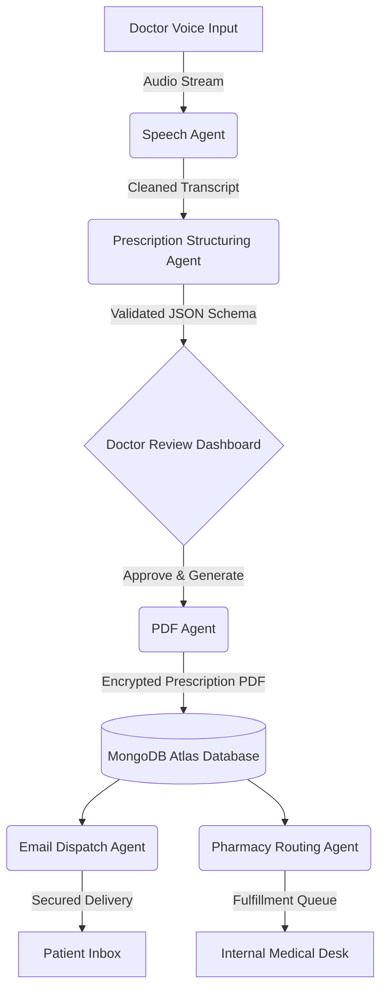

# 🩺 ScriptIQ: Next-Generation Agentic AI Prescription System

Welcome to **ScriptIQ**, an advanced, fully autonomous web application engineered to revolutionize medical consultations. By harnessing the power of cutting-edge Agentic AI, ScriptIQ allows doctors to generate highly structured, printable digital prescriptions simply by speaking naturally during patient consultations.

With a seamless, privacy-first architecture, ScriptIQ automates the entire clinical workflow: from capturing audio and structuring medical data to producing encrypted PDFs, delivering receipts directly to an in-house pharmacy, and securely dispatching encrypted prescriptions to the patient's email.

---

## 🌟 Key Features

* **🎙️ Intelligent Speech Agent** — Captures real-time consultation audio, transcribes using optimized localized speech-to-text models, and intelligently cleans up raw transcripts using Gemini AI.
* **📝 Clinical Structuring Agent** — Extracts deeply structured medical data (diagnoses, precise medication regimens, dosages, lab tests, general advice, and follow-ups) into validated JSON schemas.
* **📄 Automated PDF Generation** — Renders beautiful, professional, and compliant prescription PDFs dynamically injected with your clinic's customized letterhead and branding.
* **🔒 Privacy & Encryption Engine** — Secures all outgoing patient PDFs automatically using Date-of-Birth password encryption to comply with global healthcare privacy standards (e.g., HIPAA).
* **💾 Robust Database Persistence** — Persists complete consultation histories securely in MongoDB Atlas, featuring advanced full-text search across thousands of patient records.
* **🏥 In-House Pharmacy Routing** — Automatically matches prescribed medications against your internal pharmacy inventory, generates itemized billing receipts, and queues fulfillment orders instantly.
* **📧 Automated Email Dispatch Engine** — Securely delivers the finalized, password-protected prescription PDF directly to the patient’s inbox using an integrated SMTP architecture with zero-click automation.
* **💻 World-Class Clinical Dashboard** — A beautiful, highly ergonomic React dashboard designed for fast-paced clinical environments featuring real-time system status monitoring, interactive draft editing, and role-based access control.

---

## 🏗️ System Architecture & Workflow

ScriptIQ operates on a modular, multi-agent architecture designed for speed and reliability:



---

## 🛠️ Technology Stack

ScriptIQ leverages a modern, highly performant technology stack:

* **Frontend Dashboard**: React + Vite (TypeScript, Zustand, Lucide Icons, Custom CSS Architecture)
* **Backend Core API**: FastAPI + Uvicorn (Asynchronous REST, WebSocket Streaming)
* **Generative AI Core**: Google Gemini API (`google-genai` SDK) & localized LLM fallbacks
* **Database Layer**: MongoDB Atlas (`pymongo` with optimized query projections)
* **PDF Rendering Engine**: ReportLab (Vector graphics and dynamic typography)
* **Data Validation**: Pydantic v2 (Strict clinical schema enforcement)

---

## 🚀 Quick Start & Installation

> **Note**: For security reasons, please ensure that your environment variables (like API keys and Database URIs) are kept strictly confidential.

### 1. Clone & Setup Virtual Environment

```bash
# Clone the repository
git clone https://github.com/Saksham3736/scriptiq.git
cd scriptiq

# Create and activate a Python virtual environment
python -m venv .venv
source .venv/bin/activate  # On Windows use: .venv\Scripts\activate
```

### 2. Install Dependencies

```bash
pip install -r requirements.txt
```

### 3. Environment Configuration

Create a `.env` file in the root directory and securely configure your variables:

```env
# Database Credentials
MONGODB_URI=mongodb+srv://<secure_user>:<secure_password>@<cluster_url>
DB_NAME=ai_prescription

# AI Configuration
GEMINI_API_KEY=your_secure_gemini_api_key

# Security
JWT_SECRET_KEY=your_secure_random_jwt_secret
```

### 4. Run the FastAPI Backend Server

Start the core backend services (AI Agents and API endpoints):

```bash
uvicorn server:app --host 0.0.0.0 --port 8000
```

*The API server will be live at `http://localhost:8000` (Interactive API documentation available at `/docs`).*

### 5. Launch the Clinical Dashboard

In a new terminal window, initialize the frontend:

```bash
cd ui
npm install
npm run dev -- --host 0.0.0.0 --port 5173
```

*Access the ScriptIQ dashboard via your browser at `http://localhost:5173`.*

---

## ⚙️ Configuration & Customization

ScriptIQ features a comprehensive **System & Clinical Settings** interface directly within the dashboard. Without touching the code, administrators can:
- Fully customize the generated PDF letterhead (Hospital Name, Doctor Qualifications, Registration Number, Accent Colors, Alignments).
- Configure SMTP credentials for the integrated Email Dispatch Engine (or toggle "Simulation Mode" for safe local testing).
- Adjust AI Fallback behaviors and medical spelling auto-refinement logic.
- Manage default Follow-up durations and Pharmacy routing preferences.

---

## 🧪 Testing Suite

Run standalone unit tests for the agent pool to ensure system integrity:

```bash
# Test the database integration
python tests/test_db_agent.py

# Test PDF generation pipeline
python tests/test_pdf.py

# Test Pharmacy Inventory matching
python tests/test_pharmacy_agent.py
```

---

## 📜 License & Security Disclaimer

ScriptIQ is provided as-is for educational and developmental purposes. Always ensure that any deployment handling actual patient data complies with local healthcare privacy laws and regulations (such as HIPAA or GDPR). 

*Ensure that your `.env` configuration file is properly ignored by version control to prevent the leaking of sensitive API keys or database credentials.*
